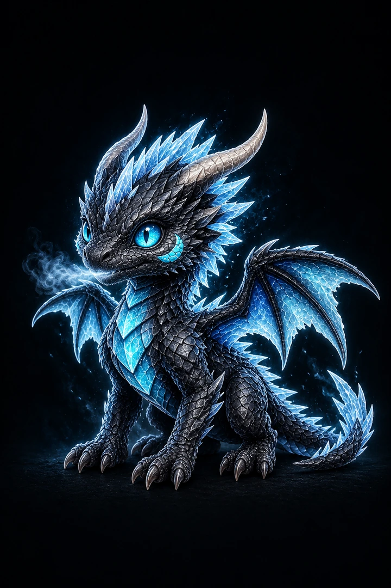
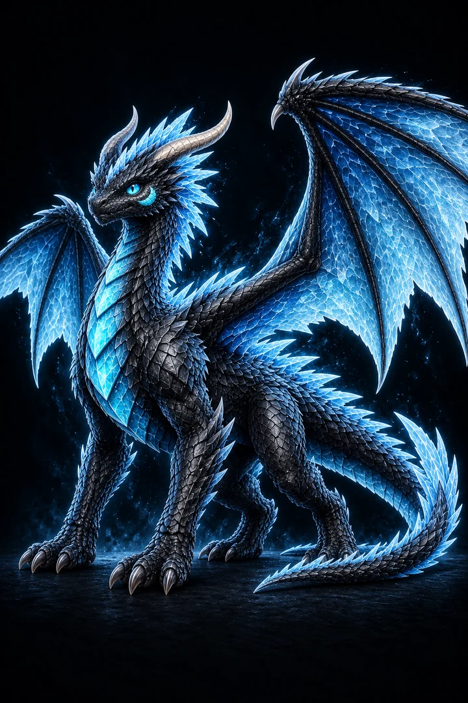
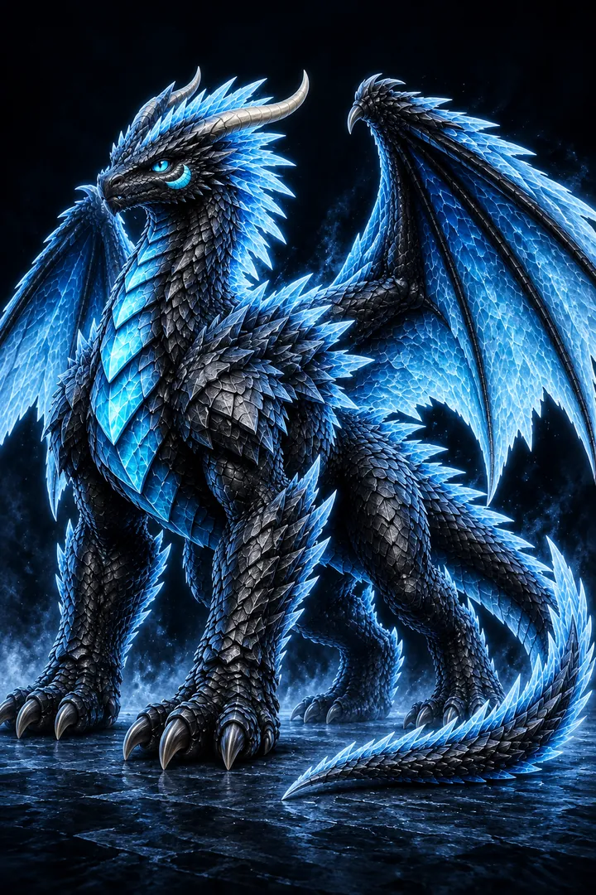
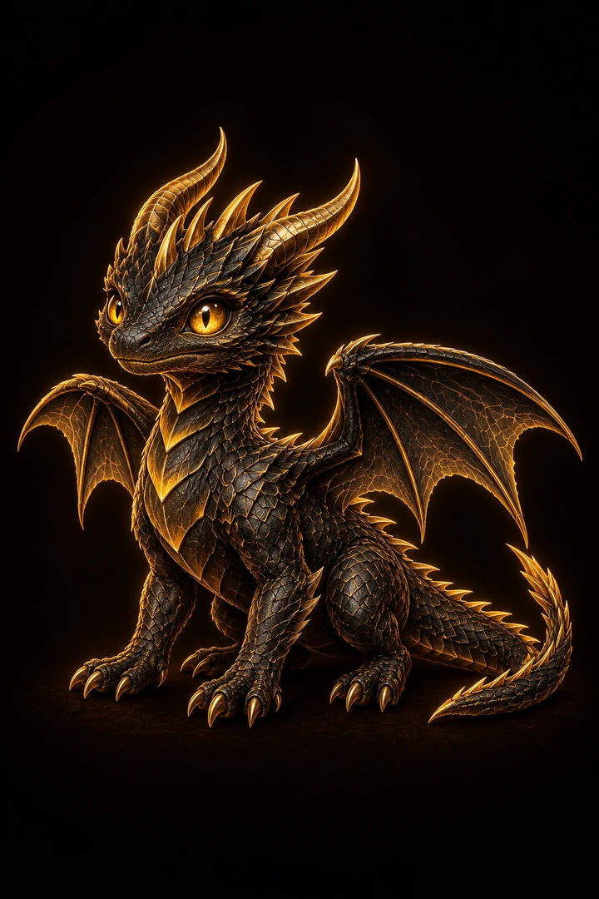
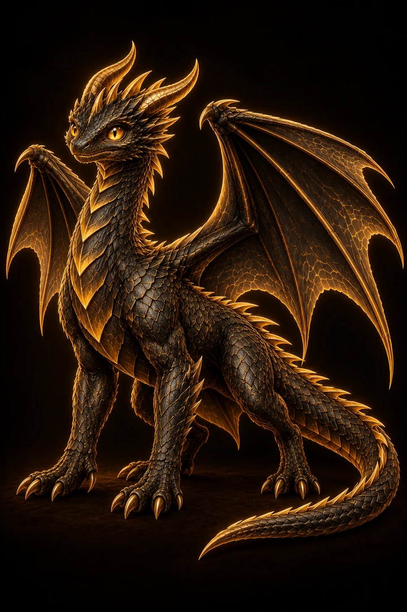
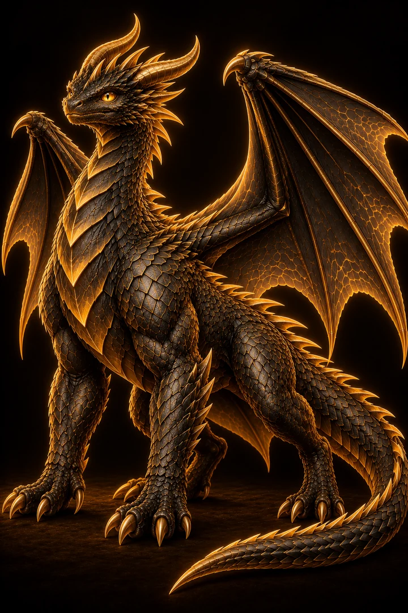
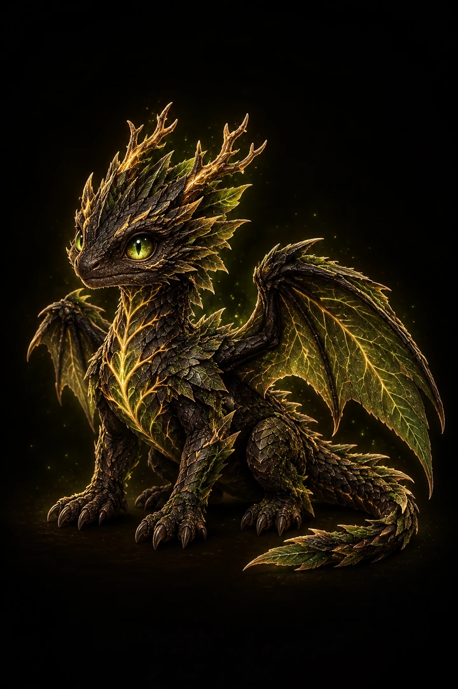
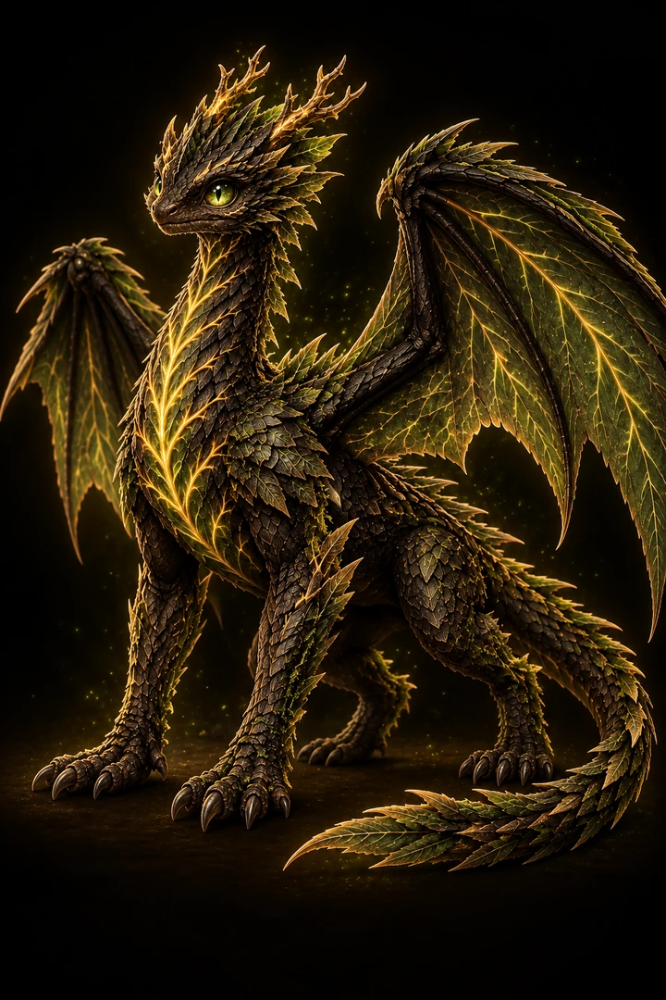
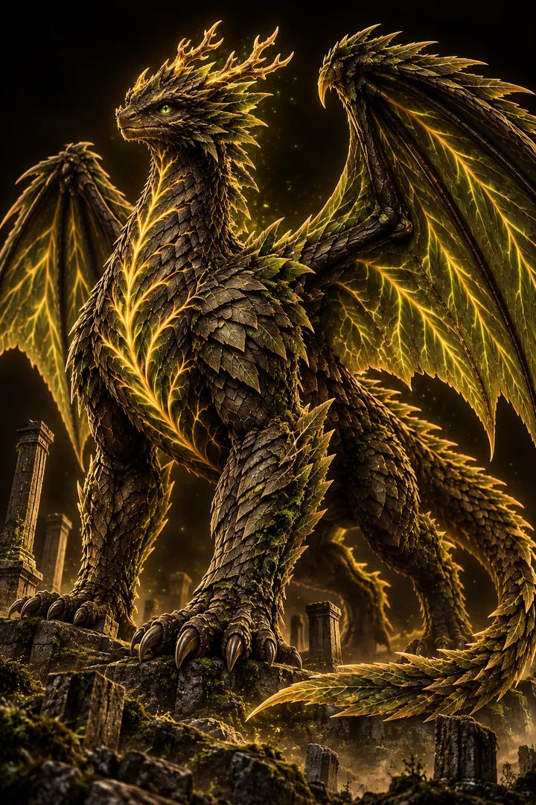

# FLOCK art pipeline

Paused by the owner on 2026-10-05. All completed work is saved on `work/gpt/art-pipeline` in PR #5; the PR is unmerged. The checkpoint has **88 ready / 8 missing stages**, **24 complete dragons**, 12 reused portraits and 76 approved generated portraits. The asset audit and all 49 tests pass at this checkpoint. Earlier typecheck, build, bundle verification and mobile browser checks passed with 30 ready stages; the evidence labels that earlier scope explicitly.

The only remaining work is the titan stage of Voidstar, Briarthorn, Mossguard, Shardling, Prismora, Quartzhelm, Giltwing and Solcrest. Their approved adult references are already in `img/`. No generation, scheduled continuation or merge runs while paused. Resume from `art_pipeline.py queue` when the owner requests continuation.

`catalog.json` is the source of truth for 32 dragons: eight families, four rarities per family, and three stages per dragon. Each entry carries two abilities, a two-sentence legend, a visual identity and an individual prompt for every stage. The existing three starters and campaign identities keep their original IDs and combat styles.

## Direct file transfer: passed

Glacielle was the end-to-end test. The connected image-generation tool returned a real local PNG for the hatchling. The adult used that hatchling as its image reference; the titan used the adult. The agent inspected the separate portraits, converted them to WebP and wrote `img/glacielle-1.webp`, `-2.webp`, and `-3.webp` directly into this repository. GitHub blob hashes were checked against the local files after upload. No owner download, screenshot, attachment or manual copy was needed.

Generation in this run uses the connected image-generation tool. The Python program handles the queue, compression, catalog updates and asset audit; it does not pretend to contain an unattended image-generation API or a scheduled worker. No new paid service, API secret or deployment is configured.

## Agent workflow

1. Run `python3 public/flock/art_pipeline.py queue`. It returns only the next eligible missing stage of each dragon, prioritizing starters, legendary dragons and existing campaign dragons.
2. Invoke the connected image tool once per portrait using the catalog prompt. For hatchlings, inspect an existing FLOCK image and use it as a style reference only. For adults and titans, pass the preceding approved stage as an image reference. A checked-in WebP can serve as the reference when the original generated PNG is no longer local.
3. Inspect every result for text, incorrect anatomy, elemental palette, horns, eyes, markings and evolution. Reject and regenerate failures. In this run the first Worldroot and Crystalith titans were rejected because their silhouettes were too close to their adults; the replacements use heavier bodies and a visible scale reference.
4. Pack approved portraits **sequentially**, because each command updates the same catalog. Example for an agent with a generated source file:

   ```sh
   python3 public/flock/art_pipeline.py pack --id glacielle --stage adult \
     --source /absolute/path/to/generated.png --review 'Approved: identity, anatomy, element and absence of text checked.'
   ```

   `pack` requires a separate 2:3 portrait, resizes it to 720 × 1080, and compresses it to at most 200,000 bytes. It records SHA-256, dimensions, size, quality, previous-stage reference and the visual review. A real grid must first be split into its separate portraits; a wrong aspect ratio is rejected rather than stretched.
5. Run `python3 public/flock/art_pipeline.py audit`. Missing files, invalid paths, wrong formats, ratio or size violations, checksum mismatches and duplicate portraits make this command fail. Resume missing work from the queue; never mark a failed generation ready.
6. Commit and upload approved assets and catalog changes to `work/gpt/art-pipeline`, keeping one PR. Verify remote blob hashes. Preserve concurrent files and use a normal, non-forced branch update.

## Game behavior

`catalog-runtime.js` builds the game roster from `catalog.json`. A species enters the roster only when all three correctly named portrait paths are ready. The same filter controls the starter screen, collection, squad, campaign opponents and unlock rewards. Art switches at levels 5 and 10. There are no shared-art or recolored-art substitutes.

When an existing save owns a temporarily hidden dragon, its ownership, level and custom partner name remain stored. A ready partner is selected temporarily; the original partner can be restored once its art returns. The save key and combat engine are preserved.

Only `public/flock/` and its new catalog tests are changed by this implementation. `public/flock-v2/`, `public/dragon-card/`, Telegram work and the Pages workflow are untouched. The concurrently added, uncatalogued `vorathion-1/2/3.webp` files on this branch are preserved. The 32-dragon counts refer strictly to catalog entries.

## Verification and deployment

Run `npm run typecheck`, `npm test`, `npm run build`, `npm run verify:bundle` and the Python asset audit. `tests/flock-catalog.test.mjs` checks the catalog shape, real assets, stage selection, missing-art filtering, saved ownership and path isolation.

The agent also exercised the game in Chromium with a 390 × 844 touch viewport, CPU ×4 and a simulated 4G connection: starter/name flow, saved name, collection, image decoding at levels 1/5/10, real attack damage and termination of all ten campaign waves using the embedded battle engine. This is mobile browser emulation, not a physical iPhone test. Checkpoint counts, hashes, resume queue and measured results with their validation scope are recorded in `evidence/art-pipeline.json`.

The PR stays unmerged. Pages updates after the PR is merged into `main` through the existing `deploy.yml` workflow.

## Three complete examples

| Dragon | Hatchling | Adult | Titan |
| --- | --- | --- | --- |
| Glacielle |  |  |  |
| Aurumarch |  |  |  |
| Worldroot |  |  |  |
